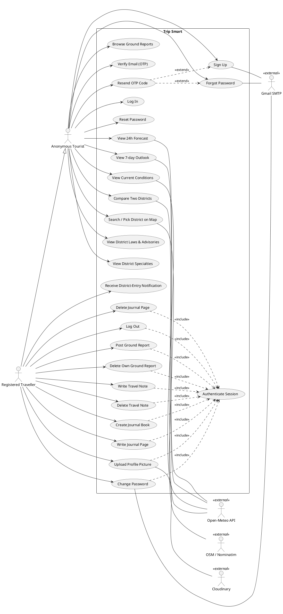
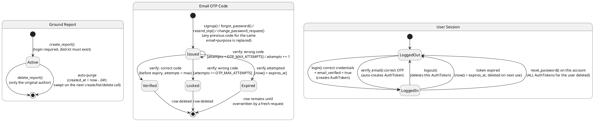
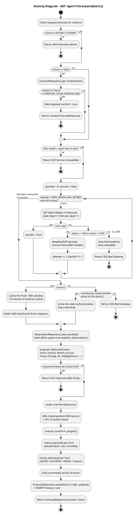
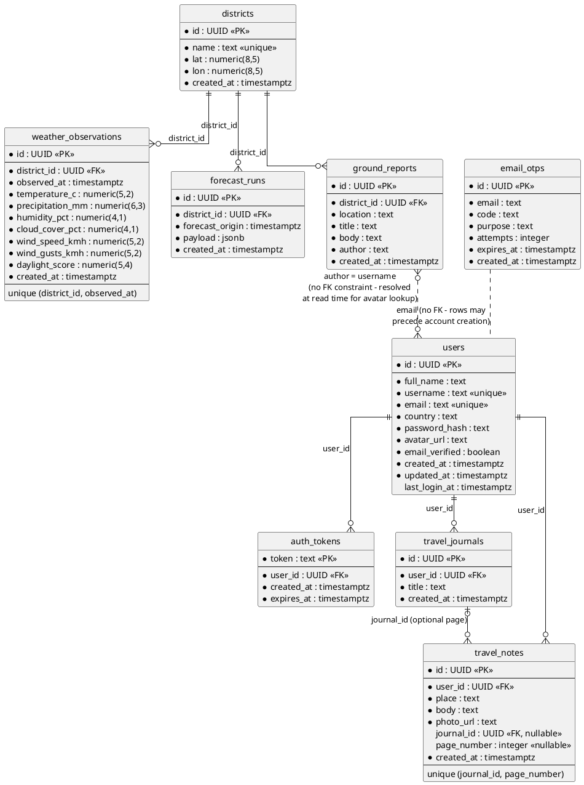
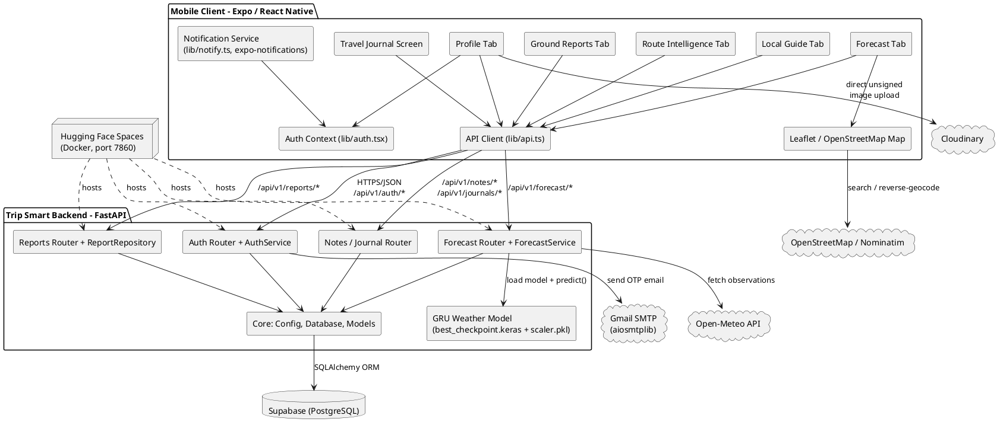
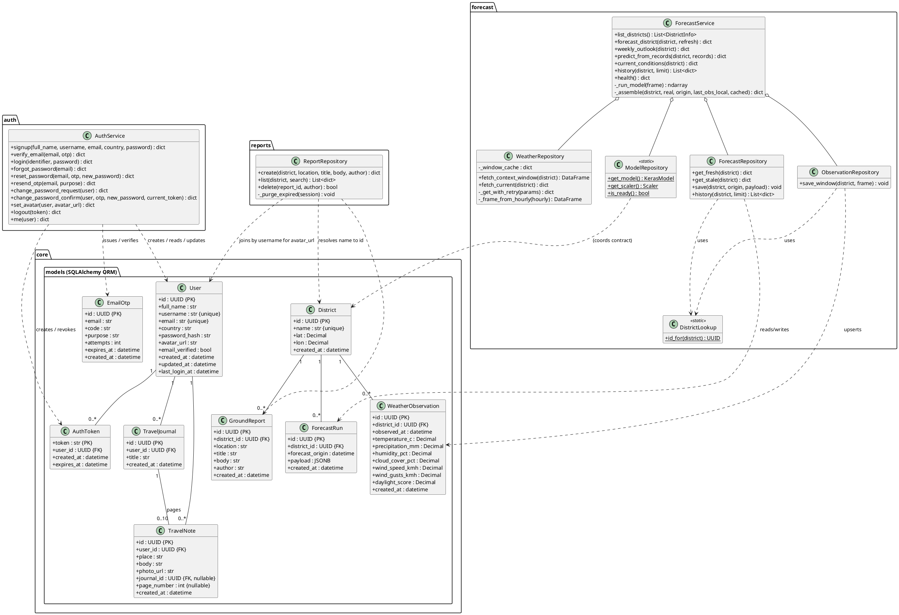
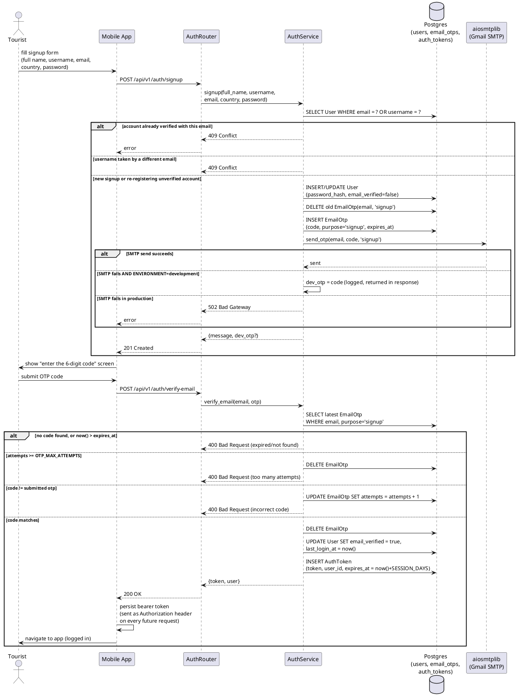
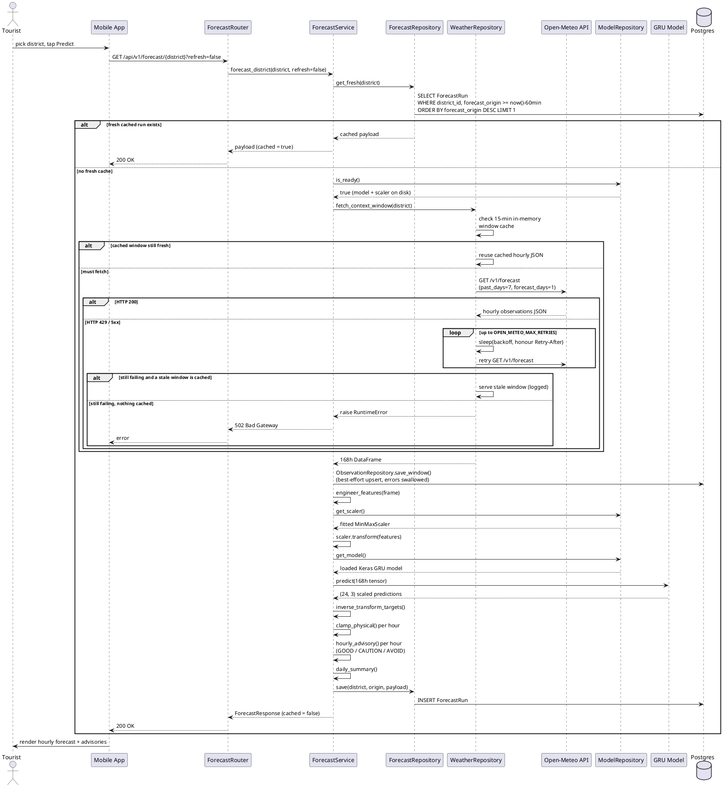

# Trip Smart — PlantUML Diagrams

Seven UML diagram types (use case, state, activity, ER, component, class, and two
sequence diagrams), reverse-engineered directly from the real codebase — not
invented — and syntax-validated with a local PlantUML render (`plantuml.jar`
v1.2024.7) before being included here. Every class name, method signature,
database column, endpoint path and status code below matches the actual
source: `Backend/core/models.py`, `Backend/auth/*`, `Backend/forecast/*`,
`Backend/reports/*`, `Backend/notes/*`, `Backend/main.py`, and the Frontend's
`app/`, `lib/api.ts`.

## How to render these

Any of the following work with the code blocks below, unmodified:

- **VS Code**: install the "PlantUML" extension (jebbs.plantuml), open this
  file, place the cursor inside a block and press `Alt+D` to preview.
- **Online**: paste a block into <https://www.plantuml.com/plantuml/uml/>.
- **CLI** (what was used to validate these): `java -jar plantuml.jar diagram.puml`
  produces a `.png` next to it. Requires only a JRE — get the jar from
  <https://github.com/plantuml/plantuml/releases>.
- **IntelliJ/PyCharm**: the "PlantUML integration" plugin renders `.puml`
  files or fenced blocks directly.

---

## 1. Use Case Diagram

Actors: an **Anonymous Tourist** can browse forecasts, laws, specialties and
ground reports, plus manage their own account, with no login. A **Registered
Traveller** *generalises* Anonymous Tourist (inherits everything above) and
additionally gets the actions that require a session — posting/deleting
reports, the notebook, the journal, notifications, and profile changes — all
routed through one shared `Authenticate Session` use case
(`auth.deps.get_current_user`, `<<include>>`d by every protected action).
`Resend OTP Code` `<<extend>>`s both Sign Up and Forgot Password, since it's
the same endpoint reused by two flows. External systems appear as secondary
actors on the use cases that actually call them.

---

## 2. State Diagram

Three independent, fully-verified state machines: a **Ground Report**'s
lifecycle (`Backend/reports/repositories.py` — expiry is a hard `DELETE`
swept on every read/write, not a soft "expired" flag); an **Email OTP
Code**'s lifecycle (`Backend/auth/services.py::_check_otp` — attempts
counter, expiry, one-shot deletion on success); and the **User Session**
states that follow from `AuthService.login` / `verify_email` / `logout` /
`reset_password`.

---

## 3. Activity Diagram

The forecast pipeline, `ForecastService.forecast_district()` in
`Backend/forecast/services.py` plus the retry/backoff/stale-fallback logic in
`Backend/forecast/repositories.py::WeatherRepository`: cache check, model
readiness check, the Open-Meteo retry loop with exponential backoff, the
15-minute window cache, the stale-forecast fallback, feature engineering,
GRU inference, and persistence.

---

## 4. Entity–Relationship (ER) Diagram

Every table in `Backend/core/models.py`, with exact column names/types and
the real foreign keys — including the two relationships that are
deliberately **not** enforced by a foreign key in the schema:
`ground_reports.author` is a plain username string resolved against `users`
only at read time (for the avatar lookup in `ReportRepository.list`), and
`email_otps` has no FK to `users` because a code can be issued for an email
before any verified account exists.

---

## 5. Component Diagram

The full system boundary: the Expo/React Native client's five tabs plus the
journal screen, all going through one API client and auth context; the
FastAPI backend's four router modules sharing one `core` (config/DB/models)
layer; the GRU model artifact; and every external system actually integrated
(`Backend/core/config.py`, `Backend/auth/emailer.py`,
`Frontend/lib/cloudinary.ts`, the Leaflet/OSM map, and the Hugging Face
Spaces Docker host from `Backend/Dockerfile`).

---

## 6. Class Diagram

The backend's actual classes across three packages, with real method
signatures: the SQLAlchemy ORM models (`core.models`), the forecast domain
(`ForecastService` and its four repositories from
`Backend/forecast/repositories.py` / `services.py`), `AuthService`
(`Backend/auth/services.py`), and `ReportRepository`
(`Backend/reports/repositories.py`).

---

## 7. Sequence Diagram — Sign Up + Email OTP Verification

Covers `POST /api/v1/auth/signup` and `POST /api/v1/auth/verify-email`
exactly as implemented in `Backend/auth/routers.py` and
`Backend/auth/services.py`, including the conflict checks, the
development-mode `dev_otp` fallback when SMTP isn't configured, and every
branch of `_check_otp` (expired, locked, wrong code, correct code).

---

## 8. Sequence Diagram — 24-Hour Forecast Request

Covers `GET /api/v1/forecast/{district}` end to end: the cache check, the
model-readiness guard, the Open-Meteo fetch with retry/backoff and the
15-minute window cache, the stale-forecast fallback, the GRU inference
steps, and the final cache write — matching
`ForecastService.forecast_district()` and
`WeatherRepository.fetch_context_window()` exactly.

